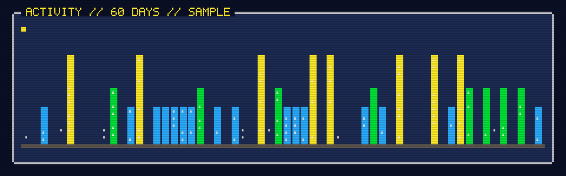

<div align="center">



<a href="#player"></a>
<a href="#skills"></a>
<a href="#quests"></a>
<a href="#cartridges"></a>
<a href="#trophies"></a>
<a href="#activity"></a>
<br>
<a href="https://www.upwork.com/freelancers/haseebkn"></a>
<a href="https://haseeb-kn.vercel.app/"></a>


</div>

<a id="player"></a>
<div align="center"></div>

<div align="center"></div>

<a id="skills"></a>
<details open>
<summary><code>> open skill_tree</code></summary>
<br>
<div align="center">

</div>
</details>

<a id="quests"></a>
<details open>
<summary><code>> open quest_log</code></summary>
<br>
<div align="center">

</div>
</details>

<a id="cartridges"></a>
<details open>
<summary><code>> open cartridge_shelf</code></summary>
<br>
<div align="center">

</div>
</details>

<details>
<summary><code>> load save_files (live links)</code></summary>
<br>

<table><tr><th align="left">Shopify</th><th align="left">Web Apps</th><th align="left">WordPress</th><th align="left">UI/UX</th></tr><tr><td valign="top"><a href="https://wear-london.com/">Wear London</a><br><a href="https://hudsonvalleyfisheries.com/">Hudson Valley Fisheries</a><br><a href="https://nulastin.com/">Nulastin</a><br><a href="https://payetmaison.com/">Payet Maison</a><br><a href="https://www.herheight.com/">Her Height</a><br><a href="https://bargear.eu/">BarGear</a><br><a href="https://www.happydaypets.com/">Happy Day Pets</a><br><a href="https://www.golftailor.eu/">GolfTailor</a><br><a href="https://beachweekend.com/">Beach Weekend</a><br><a href="https://suleneserenity.com/">Sulene Serenity</a><br><a href="https://morehairorganics.com/">More Hair Organics</a><br><a href="https://affinityhomemedical.com/">Affinity Home Medical</a><br><a href="https://ordekwaterfowl.com/">Ordek Waterfowl</a><br><a href="https://happyhandsworld.com/">Happy Hands World</a><br><a href="https://azoproducts.com/">AZO Products</a><br><a href="https://archerjerky.com/">Archer Jerky</a><br><a href="https://www.trinahotsauce.com/">Trina Hot Sauce</a></td><td valign="top"><a href="https://app.panteragpt.com/">PanteraGPT</a><br><a href="https://www.brisbanegateway.com.au/">Brisbane Gateway</a><br><a href="https://www.zooplus.com/">Zooplus</a><br><a href="https://app.kit.com/">Kit</a><br><a href="https://www.skindoc.uk/">SkinDoc</a><br><a href="https://app.saalz.com/">Saalz CRM</a><br><a href="https://www.skyscanner.pk/">Skyscanner</a><br><a href="https://ecommerce-haseeb.vercel.app/">Ecommerce Store</a><br><a href="https://devsafe.vercel.app/">Secure Dev Platform</a><br><a href="https://keyvault-api-manager.vercel.app/">API Manager</a></td><td valign="top"><a href="https://petco.pk/">Petco Pakistan</a><br><a href="https://www.mightycall.com/">MightyCall</a><br><a href="https://sharepointdesignworks.com/">SharePoint Design Works</a><br><a href="https://wolfpackwrestlingtx.com/">Wolfpack Wrestling TX</a><br><a href="https://learnmate.com.au/">Learnmate Australia</a></td><td valign="top"><a href="https://www.farminbox.in/">FarmInBox</a><br><a href="https://www.terrapay.com/">TerraPay</a><br><a href="https://www.tentwenty.me/">TenTwenty</a><br><a href="https://www.colabsoftware.com/">Colab Software</a></td></tr></table>

</details>

<a id="trophies"></a>
<details open>
<summary><code>> open achievements</code></summary>
<br>
<div align="center">

</div>
</details>

<a id="activity"></a>
<details open>
<summary><code>> open activity_skyline</code></summary>
<br>
<div align="center">

</div>
</details>

<details>
<summary><code>> cat player_contacts.txt</code></summary>

```text
portfolio   https://haseeb-kn.vercel.app/
upwork      https://www.upwork.com/freelancers/haseebkn
linkedin    https://www.linkedin.com/in/haseeb-developer
codepen     https://codepen.io/haseebdevv
email       mhaseebkn@gmail.com
```

</details>

<details>
<summary><code>> cat plain_text_mode.txt</code></summary>

```text
Muhammad Haseeb · Frontend & Shopify Developer · Islamabad, Pakistan
Senior Shopify / React.js Developer at Markloops (10/2024 - present)
Before: Node Agency (07/2023 - 10/2024), Uptek (05/2022 - 07/2023)
100+ projects delivered · 20+ Shopify and WordPress builds · 4+ years frontend
Languages: JavaScript, TypeScript, HTML, CSS, SQL
Frontend: React.js, Next.js, Redux Toolkit, Tailwind CSS, SCSS, REST APIs
Commerce: Shopify, Liquid, WordPress, WooCommerce
Backend: Supabase, PostgreSQL, Vercel, Netlify, Clerk
Exploring: Linux, Docker, Python, Agentic AI, AI workflow
```

</details>

<div align="center"><a href="https://www.upwork.com/freelancers/haseebkn"></a></div>
