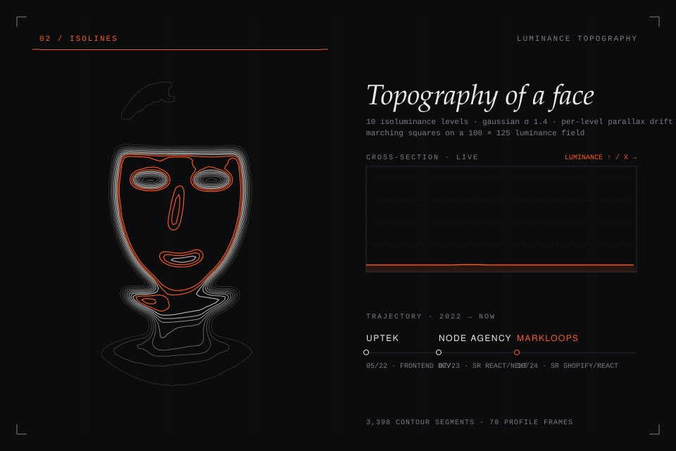
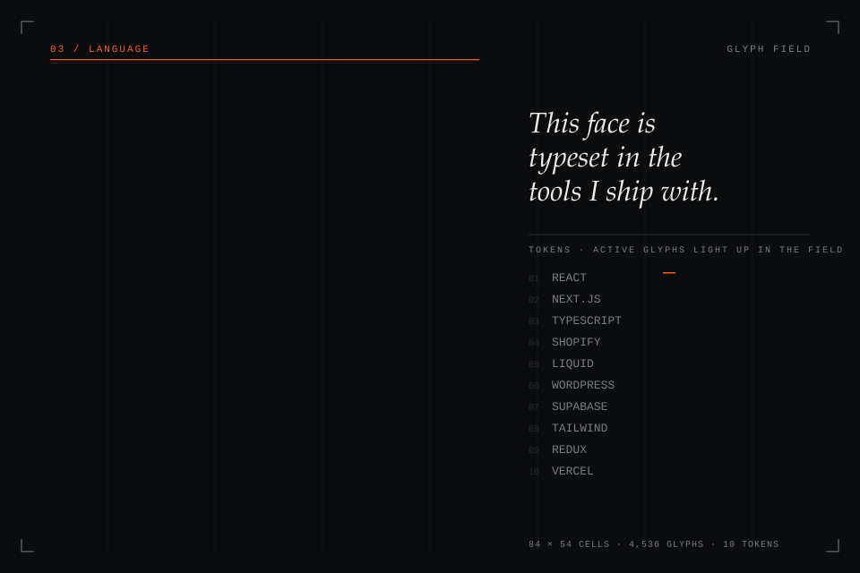
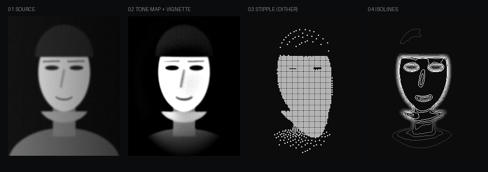

<div align="center">

<sub><code><a href="#reconstruction">01 reconstruction</a> &nbsp;/&nbsp; <a href="#isolines">02 isolines</a> &nbsp;/&nbsp; <a href="#language">03 language</a> &nbsp;/&nbsp; <a href="https://haseeb-kn.vercel.app/">portfolio</a> &nbsp;/&nbsp; <a href="https://www.upwork.com/freelancers/haseebkn">hire</a></code></sub>

</div>

<a id="reconstruction"></a>
<details open>
<summary><code>01 / reconstruction</code></summary>
<br>
<div align="center"></div>
</details>

<a id="isolines"></a>
<details open>
<summary><code>02 / isolines</code></summary>
<br>
<div align="center"></div>
</details>

<a id="language"></a>
<details open>
<summary><code>03 / language</code></summary>
<br>
<div align="center"></div>
</details>

<details>
<summary><code>&gt; inspect pipeline: how this was made</code></summary>
<br>
<div align="center"></div>

Photo → tone map (percentile stretch, local contrast, elliptical vignette) → three independent renderers. Everything is precomputed by `build.py` into pure SVG, because GitHub strips JavaScript: the motion is SMIL and CSS keyframes.
</details>

<details>
<summary><code>&gt; ls /work</code></summary>
<br>

<table><tr><th align="left">Shopify</th><th align="left">Web Apps</th><th align="left">WordPress</th><th align="left">UI/UX</th></tr><tr><td valign="top"><a href="https://wear-london.com/">Wear London</a><br><a href="https://hudsonvalleyfisheries.com/">Hudson Valley Fisheries</a><br><a href="https://nulastin.com/">Nulastin</a><br><a href="https://payetmaison.com/">Payet Maison</a><br><a href="https://www.herheight.com/">Her Height</a><br><a href="https://bargear.eu/">BarGear</a><br><a href="https://www.happydaypets.com/">Happy Day Pets</a><br><a href="https://www.golftailor.eu/">GolfTailor</a><br><a href="https://beachweekend.com/">Beach Weekend</a><br><a href="https://suleneserenity.com/">Sulene Serenity</a><br><a href="https://morehairorganics.com/">More Hair Organics</a><br><a href="https://affinityhomemedical.com/">Affinity Home Medical</a><br><a href="https://ordekwaterfowl.com/">Ordek Waterfowl</a><br><a href="https://happyhandsworld.com/">Happy Hands World</a><br><a href="https://azoproducts.com/">AZO Products</a><br><a href="https://archerjerky.com/">Archer Jerky</a><br><a href="https://www.trinahotsauce.com/">Trina Hot Sauce</a></td><td valign="top"><a href="https://app.panteragpt.com/">PanteraGPT</a><br><a href="https://www.brisbanegateway.com.au/">Brisbane Gateway</a><br><a href="https://www.zooplus.com/">Zooplus</a><br><a href="https://app.kit.com/">Kit</a><br><a href="https://www.skindoc.uk/">SkinDoc</a><br><a href="https://app.saalz.com/">Saalz CRM</a><br><a href="https://www.skyscanner.pk/">Skyscanner</a><br><a href="https://ecommerce-haseeb.vercel.app/">Ecommerce Store</a><br><a href="https://devsafe.vercel.app/">Secure Dev Platform</a><br><a href="https://keyvault-api-manager.vercel.app/">API Manager</a></td><td valign="top"><a href="https://petco.pk/">Petco Pakistan</a><br><a href="https://www.mightycall.com/">MightyCall</a><br><a href="https://sharepointdesignworks.com/">SharePoint Design Works</a><br><a href="https://wolfpackwrestlingtx.com/">Wolfpack Wrestling TX</a><br><a href="https://learnmate.com.au/">Learnmate Australia</a></td><td valign="top"><a href="https://www.farminbox.in/">FarmInBox</a><br><a href="https://www.terrapay.com/">TerraPay</a><br><a href="https://www.tentwenty.me/">TenTwenty</a><br><a href="https://www.colabsoftware.com/">Colab Software</a></td></tr></table>

</details>

<details>
<summary><code>&gt; cat contact</code></summary>

```text
portfolio   https://haseeb-kn.vercel.app/
upwork      https://www.upwork.com/freelancers/haseebkn
linkedin    https://www.linkedin.com/in/haseeb-developer
codepen     https://codepen.io/haseebdevv
email       mhaseebkn@gmail.com
```

</details>

<details>
<summary><code>&gt; cat plain.txt</code></summary>

```text
Muhammad Haseeb · Frontend & Shopify Developer · Islamabad, Pakistan
Senior Shopify / React.js Developer, Markloops (10/2024 - present)
Before: Node Agency (07/2023 - 10/2024), Uptek (05/2022 - 07/2023)
100+ projects · 20+ Shopify and WordPress builds · 4+ years frontend
JavaScript, TypeScript, HTML, CSS, SQL · React.js, Next.js, Redux Toolkit, Tailwind CSS, SCSS
Shopify, Liquid, WordPress, WooCommerce · Supabase, PostgreSQL, Vercel, Netlify, Clerk
Exploring: Linux, Docker, Python, Agentic AI
```

</details>

<div align="center"><a href="https://www.upwork.com/freelancers/haseebkn"></a></div>
